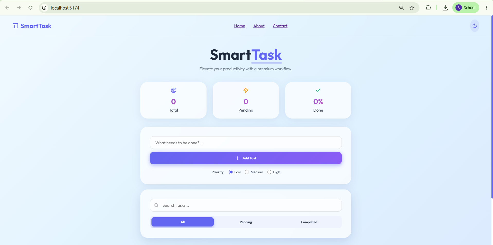
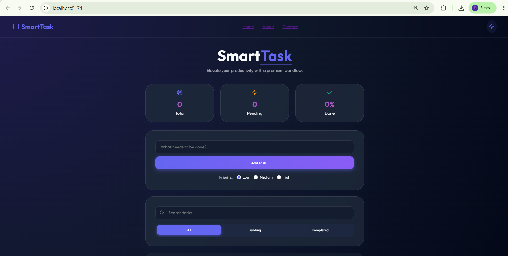
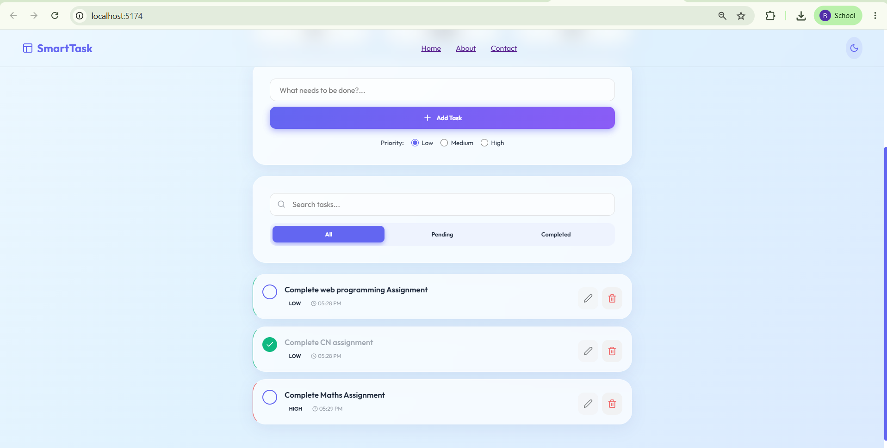
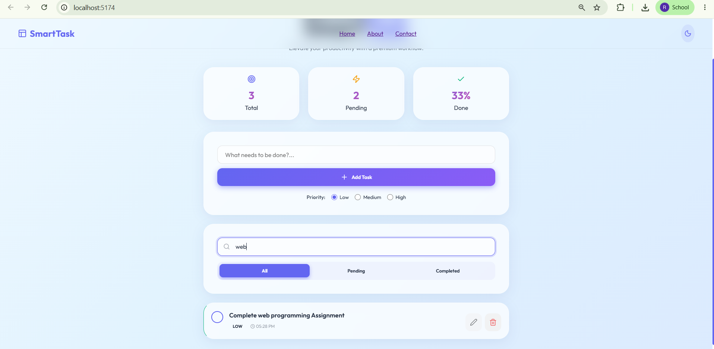
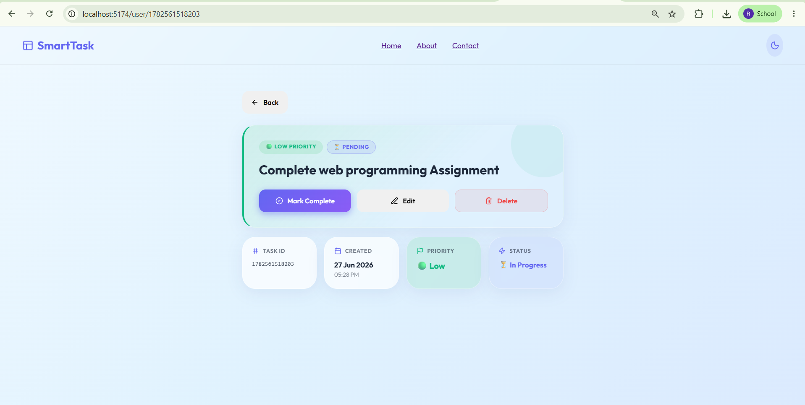
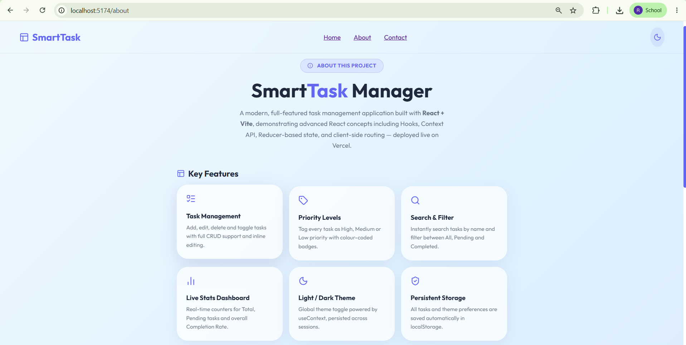
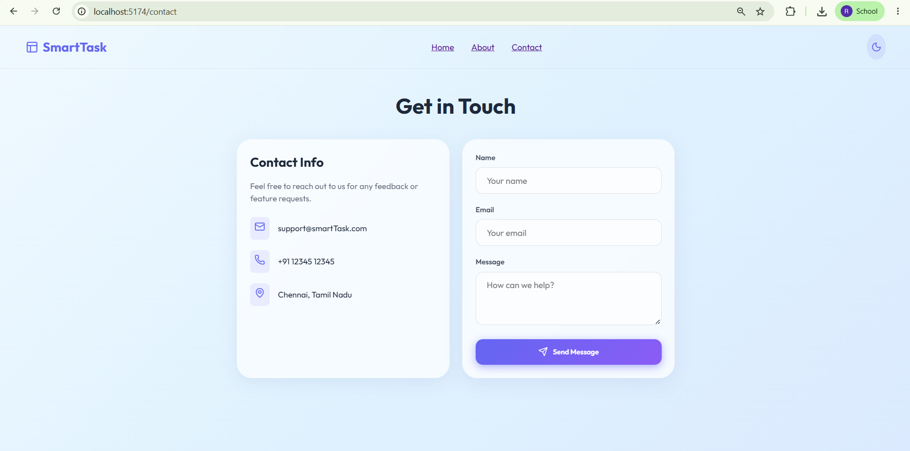
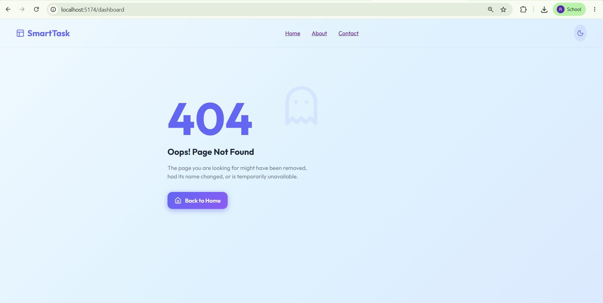

<div align="center">

# Smart Task Manager

**A modern, full-featured task management web application built with React + Vite.**  
Manage your tasks with priority levels, real-time filtering, light/dark theme, and persistent storage — all in a sleek, responsive interface.

[](https://react.dev/)
[](https://vitejs.dev/)
[](https://reactrouter.com/)
[](https://smart-task-manager-liard.vercel.app)

</div>

---

## 🌐 Live Demo

🔗 **[View Live on Vercel →](https://smart-task-manager-liard.vercel.app)**

---

## 📸 Screenshots

### 🏠 Home — Light Mode


### 🌙 Home — Dark Mode


### ➕ Adding a Task


### 🔍 Search & Filter


### 🔗 Task Detail Page


### ℹ️ About Page


### 📬 Contact Page


### 🚫 404 Not Found


---

## ✨ Features

- **Task CRUD** — Add, edit, delete and toggle tasks with full inline editing
- **Priority Levels** — Tag tasks as 🔴 High, 🟡 Medium, or 🟢 Low priority
- **Search & Filter** — Instantly search by name; filter All / Pending / Completed
- **Live Stats** — Real-time Total, Pending, and Completion Rate counters
- **Light / Dark Theme** — One-click toggle with theme preference saved to `localStorage`
- **Dynamic Routing** — Click any task to open its detail page (`/user/:id`)
- **Responsive Design** — Desktop sidebar nav + mobile bottom navigation bar
- **Task Persistence** — Tasks are loaded from `localStorage` on startup and automatically saved on every change
- **Theme Persistence** — Selected theme (light/dark) is stored in `localStorage` and restored on every visit


---

## 🛠️ Tech Stack

| Technology | Purpose |
|---|---|
| **React 19** | UI framework |
| **Vite 8** | Build tool & dev server |
| **React Router DOM v7** | Client-side multi-page routing |
| **useReducer** | Centralized task state management |
| **useContext** | Global light/dark theme provider |
| **localStorage** | Data persistence across sessions |
| **Lucide React** | Icon library |
| **Vercel** | Production deployment |

---

## 📁 Project Structure

```
src/
├── components/
│   └── Navbar.jsx          # Navigation bar (desktop + mobile)
├── context/
│   └── ThemeContext.jsx     # Global Light/Dark theme via useContext
├── pages/
│   ├── Home.jsx            # Task dashboard with useReducer state
│   ├── About.jsx           # About page
│   ├── Contact.jsx         # Contact form
│   ├── UserDetail.jsx      # Dynamic route page (/user/:id)
│   └── NotFound.jsx        # 404 error page
├── reducers/
│   └── taskReducer.js      # Reducer with 6 action types
├── App.jsx                 # Router & route definitions
├── main.jsx                # Entry point — ThemeProvider wrapper
└── index.css               # Global styles & CSS variables
```

---

## 🚀 Getting Started

### Prerequisites
- [Node.js](https://nodejs.org/) v18 or above
- npm

### Installation

```bash
# Clone the repository
git clone https://github.com/Laxmiharika522/Smart-Task-Manager

# Navigate into the project
cd Smart-Task-Manager

# Install dependencies
npm install

# Start the development server
npm run dev
```

Open **http://localhost:5173** in your browser.

---

## 📜 Available Scripts

| Command | Description |
|---|---|
| `npm run dev` | Start local development server |
| `npm run build` | Build for production (outputs to `dist/`) |
| `npm run preview` | Preview the production build locally |

---

## 🗂️ Routing Overview

| Route | Page | Description |
|---|---|---|
| `/` | Home | Task dashboard |
| `/about` | About | App information |
| `/contact` | Contact | Contact form |
| `/user/:id` | Task Detail | Dynamic task detail with `useParams()` |
| `*` | 404 Not Found | Wildcard catch-all route |

---

## 👩‍💻 Author

**Laxmiharika** — [GitHub @Laxmiharika522](https://github.com/Laxmiharika522)


